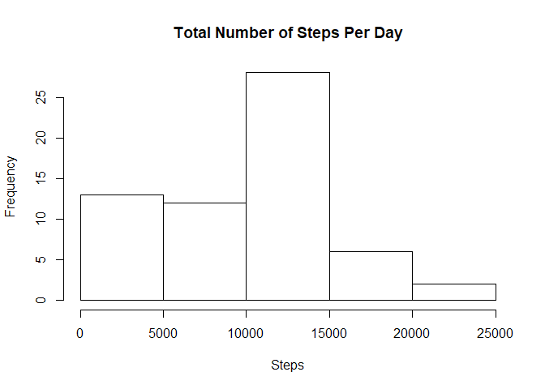
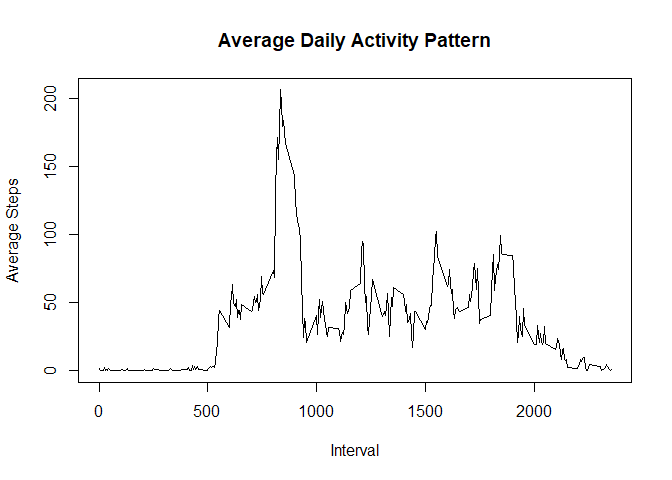
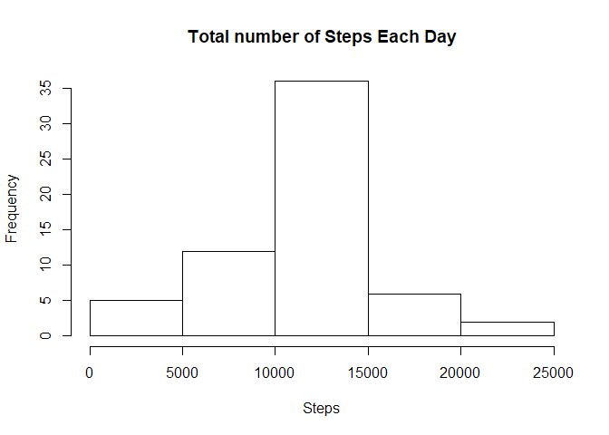
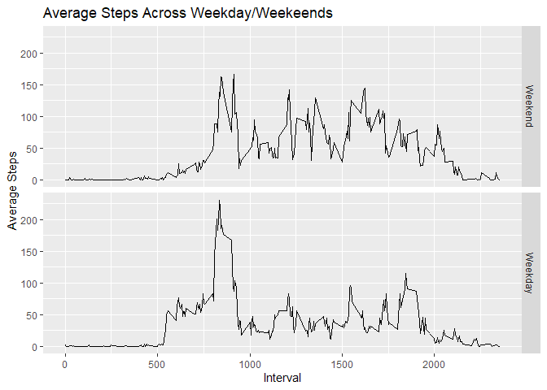

```r
setwd("C:/Users/jiash/Dropbox/R-repo/RepData_PeerAssessment1")
library(ggplot2)
library(dplyr)
```

```
## 
## Attaching package: 'dplyr'
```

```
## The following objects are masked from 'package:stats':
## 
##     filter, lag
```

```
## The following objects are masked from 'package:base':
## 
##     intersect, setdiff, setequal, union
```

## Loading and preprocessing the data

```r
activity <- read.csv("activity/activity.csv",
                     header = TRUE,
                     na.string = "?",
                     colClasses = c("numeric", NA, "numeric"))

activity$newDate = as.Date(activity$date, format = "%Y-%m-%d")
```

## What is mean total number of steps taken per day?

```r
stepsByDay <- aggregate(activity$steps, by = list(Day = activity$newDate), FUN = sum, na.rm = TRUE)
hist(stepsByDay$x, main = "Total Number of Steps Per Day", xlab = "Steps")
```

<!-- -->

```r
# Mean of total number of steps taken per day
mean(stepsByDay$x)
```

```
## [1] 9354.23
```

```r
# Median of total number of steps taken per day
median(stepsByDay$x)
```

```
## [1] 10395
```

## What is the average daily activity pattern?

```r
avgDailyAct <- aggregate(activity$steps, by = list(Interval = activity$interval), FUN = mean, na.rm = TRUE)
plot(avgDailyAct$Interval, avgDailyAct$x, type = "l", xlab= "Interval", ylab = "Average Steps", main="Average Daily Activity Pattern")
```

<!-- -->

```r
# Across the dataset, the following contains the max no of steps
avgDailyAct[avgDailyAct$x == max(avgDailyAct$x),]
```

```
##     Interval        x
## 104      835 206.1698
```

## Imputing missing values

```r
sum(is.na(activity))
```

```
## [1] 2304
```

```r
missingCol <- colnames(activity)[apply(activity, 2, anyNA)]
filledAct <- activity
filledAct$newDate = as.Date(filledAct$date, format = "%Y-%m-%d")

# We group by interval in this case because some dates do not have steps recorded e.g. 2012-10-01
filledAct$steps <- ave(filledAct$steps, filledAct$interval, FUN = function(x) {
  ifelse(is.na(x), mean(x, na.rm = TRUE), x)
})

filledActByDay <- aggregate(filledAct$steps, by = list(day = filledAct$newDate), FUN = sum)
hist(filledActByDay$x, main = "Total number of Steps Each Day", xlab = "Steps")
```

<!-- -->

```r
# Mean of total number of steps taken per day
mean(filledActByDay$x)
```

```
## [1] 10766.19
```

```r
# Median of total number of steps taken per day
median(filledActByDay$x)
```

```
## [1] 10766.19
```
## Are there differences in activity patterns between weekdays and weekends?

```r
filledAct$Day <- weekdays(filledAct$newDate, abbreviate = FALSE)
weekdays <- c('Monday', 'Tuesday', 'Wednesday', 'Thursday', 'Friday')
filledAct$DayType <- factor(filledAct$Day %in% weekdays, labels = c('Weekend', 'Weekday'))

avgStepsByWe <- aggregate(filledAct$steps, by = list(Interval = filledAct$interval, Day = filledAct$DayType), FUN = mean)
ggplot(avgStepsByWe, mapping = aes(Interval, x)) +
  geom_line() +
  facet_grid(rows = vars(Day)) + 
  ylab("Average Steps") +
  ggtitle("Average Steps Across Weekday/Weekeends")
```

<!-- -->
There are differences between weekend and weekdays. Between interval 500 and 1000, there is a much larger spike in average steps in the weekday than the weekend.
